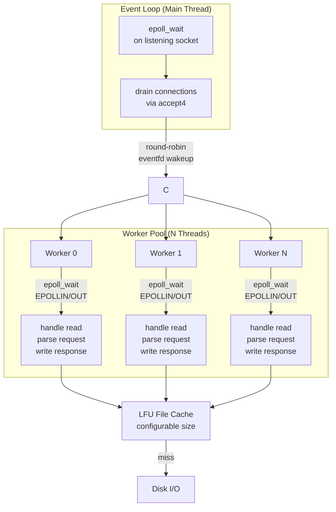

<p align="center">
  <h1 align="center">TinyReactor</h1>
  <p align="center">A lightweight reactor-pattern HTTP server in C++23</p>
</p>

<p align="center">
  <a href="#features">Features</a> •
  <a href="#quick-start">Quick Start</a> •
  <a href="#architecture">Architecture</a> •
  <a href="#benchmarks">Benchmarks</a> •
  <a href="#how-it-works">How It Works</a>
</p>

<p align="center">
  
  
  
  
  
</p>

---

TinyReactor is a from-scratch HTTP server that explores Linux system programming through the reactor pattern. It uses **epoll edge-triggered I/O**, a **multi-threaded worker pool**, and an **LFU file cache** — with zero external dependencies beyond the C++ standard library and Linux kernel interfaces.

```
~21,000–22,000 req/s sustained on modest hardware.
```

---

## Features

| Area | Detail |
|---|---|
| **Reactor pattern** | Single-threaded event loop accepts connections, distributes to workers |
| **Epoll edge-triggered** | `EPOLLET` with full drain on each readiness notification |
| **Multi-threaded workers** | Configurable pool, lock-free round-robin distribution via `eventfd` |
| **HTTP/1.1** | Request parsing, response serialization, MIME type mapping |
| **Keep-Alive** | Persistent connections when the client requests it |
| **LFU file cache** | Configurable-size least-frequently-used cache with `mtime` staleness checks |
| **Path traversal protection** | `realpath` resolution verified against document root |
| **Configuration file** | Simple key-value config for port, threads, epoll events, cache size, document root |

## Quick Start

```sh
# Build
cmake -B build -DCMAKE_BUILD_TYPE=Release
cmake --build build

# Run
./build/TinyReactor tinyreactor.conf
```

Open [http://localhost:8080](http://localhost:8080).

<details>
<summary><b>Configuration reference</b></summary>

```ini
port = 8080              # Listening port (default: 8080)
num_threads = 16         # Worker thread count (default: 16)
max_epoll_events = 1024  # Max events per epoll_wait (default: 1024)
max_cache_size = 128     # Max LFU cache entries per worker (default: 128)
document_root = .        # Document root directory (default: .)
```

Lines starting with `#` are comments. Whitespace around keys/values is trimmed.
</details>

## Architecture



## Benchmarks

HTTP benchmark results using Apache Bench on a Fedora 43 WSL instance (16 threads, Release build):

| Scenario | Requests | Concurrency | Keep-Alive | Requests/sec | P99 latency |
|---|---|---|---|---|---|
| Small file (53 B) | 100,000 | 100 | Yes | ~20,627 | 12 ms |
| Small file (53 B) | 50,000 | 500 | Yes | ~21,438 | 43 ms |
| Small file (53 B) | 20,000 | 100 | No | ~20,772 | 12 ms |
| Larger file (157 B) | 50,000 | 200 | Yes | ~22,474 | 18 ms |

**Zero failed requests across all tests.** See [BENCHMARKS.md](BENCHMARKS.md) for full details.

## How It Works

- **EventLoop** creates a non-blocking listening socket, registers it with epoll, and waits. On each `EPOLLIN` event, it drains all pending connections via `accept4` and distributes them to workers in round-robin order using `eventfd`.
- **Worker threads** each run their own epoll instance. When woken, they register new client fds (edge-triggered), then handle read readiness by buffering data, parsing the HTTP request, looking up the file (with LFU caching), and writing the response asynchronously. If the response doesn't fit in one `write`, the worker re-registers for `EPOLLOUT`.
- **LFU file cache** stores up to `max_cache_size` entries per worker (default 128). On lookup, it checks the file's `mtime` against the cached value. On eviction, the least-frequently-used entry is dropped — no LRU, no timer wheels, just a hit-count multimap.

---

<p align="center">
  Built with the Linux kernel API and C++23
</p>
# TinyReactor
